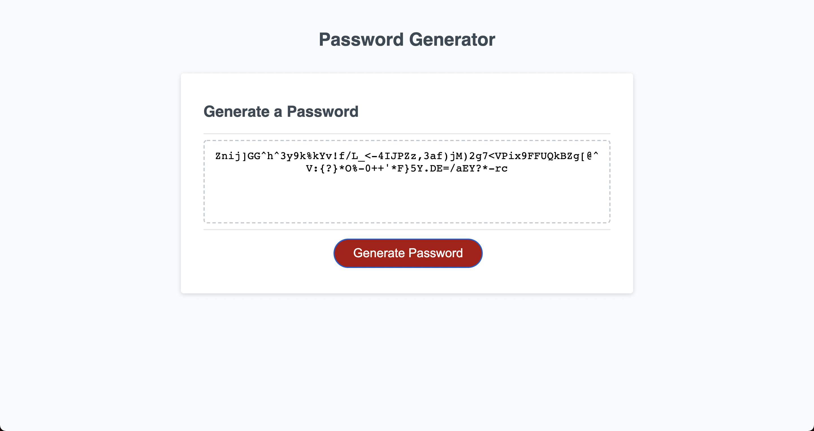

### Deployed Live Version
- https://bdejene19.github.io/RandomPasswordGenerator/

# Password Generator

## Live Version Screen Shot

## About 
This application allows a user to have a randomly generated password based on a set amount of criteria the user has defined. When the red button 'Generate Password' is clicked, a series of prompt and confirm messages will occur. The purpose of these prompts/confirms is to gain criteria for the random password that will be generated. Once all criteria has been filled, it will be validated. If the criteria set are valid then a random password will be generated and displayed on the screen within the text area.

